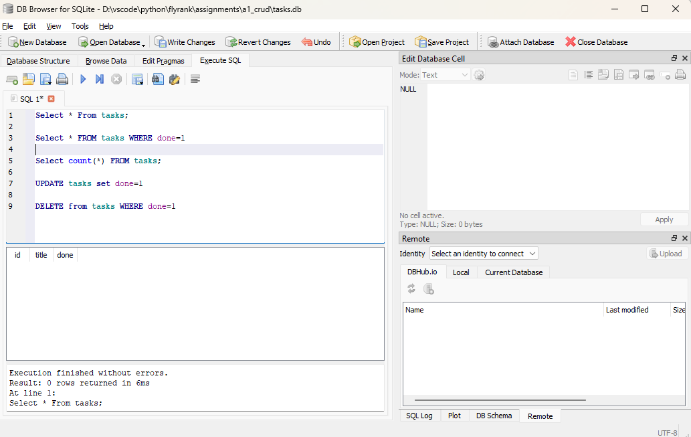
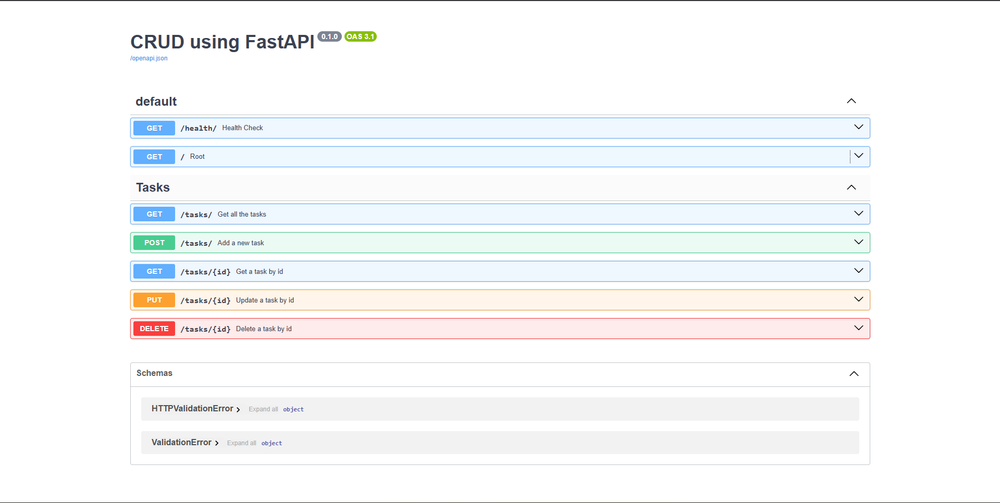

# Flyrank Assignments

This repository contains multiple assignments for Flyrank, including a modern, professional FastAPI project (`a1_crud`) demonstrating a CRUD application using SQLAlchemy, Pydantic V2, and Alembic.

## How to Install & Run

Navigate to the `a1_crud` directory and run the application using `uv`:

```bash
cd a1_crud
uv run uvicorn app.main:app --reload
```

## Database Implementation

**Why SQLite was chosen:**
SQLite was selected because it is a lightweight, zero-configuration database that doesn't require setting up a separate background server. It stores everything in a single local file, making it incredibly easy to manage, test, and deploy for this CRUD assignment.

**Database Storage Location:**
The entire database is stored locally in a single file named `tasks.db`, located right in the root of the `a1_crud` directory.

**Example SQL Query Executed:**
Here is an example of a raw SQL query used in this project to insert a new task:
```sql
INSERT INTO tasks (title) VALUES ('Complete Assignment 2');
```

**Database Viewer Screenshot:**
*(Please place your DB viewer screenshot at `a1_crud/assets/db_viewer.png`)*


## API Endpoints

Here is a list of all available endpoints in the application:

| Method | Endpoint | Description |
|--------|----------|-------------|
| GET | `/` | Welcome message |
| GET | `/health/` | Health check endpoint |
| GET | `/tasks/` | Get all the tasks |
| GET | `/tasks/{id}` | Get a task by id |
| POST | `/tasks/` | Add a new task |
| PUT | `/tasks/{id}` | Update a task by id |
| DELETE | `/tasks/{id}` | Delete a task by id |

## Example Request

```http
$ curl -i http://127.0.0.1:8000/

HTTP/1.1 200 OK
date: Tue, 21 Jul 2026 16:44:51 GMT
server: uvicorn
content-length: 43
content-type: application/json

{"message":"Welcome to the 1st Assignment"}
```

## Swagger Screenshot



