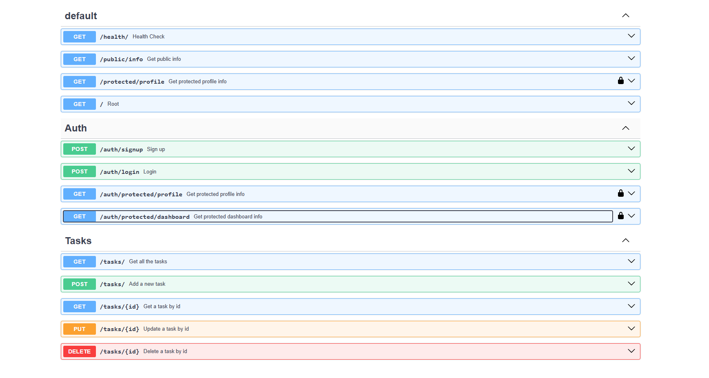

# Flyrank Assignments - FastAPI CRUD with Docker & PostgreSQL

This is a modern, containerized FastAPI CRUD application. It demonstrates a complete stack running in Docker Compose, using PostgreSQL as the persistent database, and raw `psycopg` for direct database interactions with retry mechanisms for robust startup.

## How to Install & Run

1. Clone the repository and navigate into the `a1_crud` folder.
2. Setup your environment variables (see below).
3. Start the entire application and database with this one command:

```bash
docker compose up
```

## Environment Variables

Before running the application, you need to set up your environment variables. 
Copy the provided `.env.example` file to a new file named `.env`:

```bash
cp .env.example .env
```
*(The `.env` file should contain the necessary `DATABASE_URL` and `POSTGRES_*` variables for the Docker containers to work correctly).*

## API Endpoints

Here is a list of all available endpoints in the application:

| Method | Endpoint | Description |
|--------|----------|-------------|
| GET | `/` | Welcome message |
| GET | `/health/` | Health check endpoint |
| GET | `/tasks/` | Get all the tasks |
| GET | `/tasks/{id}` | Get a task by id |
| POST | `/tasks/` | Add a new task |
| PUT | `/tasks/{id}` | Update a task by id |
| DELETE | `/tasks/{id}` | Delete a task by id |
| POST | `/auth/signup` | Sign up a new user |
| POST | `/auth/login` | Login to receive an access token |
| GET | `/auth/protected/profile` | Get protected profile info (requires token) |
| GET | `/auth/protected/dashboard` | Get protected dashboard info (requires token) |

### Auth Swagger UI



## Example Request

```http
$ curl -i http://127.0.0.1:8000/tasks/

HTTP/1.1 200 OK
date: Sun, 16 Aug 2026 20:44:42 GMT
server: uvicorn
content-length: 156
content-type: application/json
Connection: close

[{"title":"Book 1","id":1,"done":true},{"title":"Book 2","id":2,"done":false},{"title":"Book 3","id":3,"done":false},{"title":"Book 4","id":4,"done":false}]
```

## Database Storage & Verification

The data is securely stored inside a PostgreSQL database running in its own container (`a1_crud-db-1`).

Here is a look directly inside our running database via `psql`:

```text
$ docker exec a1_crud-db-1 psql -U postgres -d tasks -c '\dt' -c 'SELECT * FROM tasks;'

         List of relations
 Schema | Name  | Type  |  Owner   
--------+-------+-------+----------
 public | tasks | table | postgres
(1 row)

 id | title  | done 
----+--------+------
  1 | Book 1 | t
  2 | Book 2 | f
  3 | Book 3 | f
  4 | Book 4 | f
(4 rows)
```
